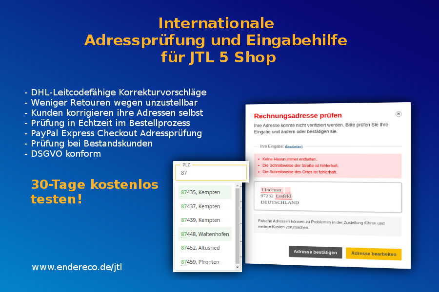

# Internationale Adressprüfung von Endereco für JTL 5 Shops

Kompatibel mit JTL Shop ab Version 5. Kompatibel mit Nova Template.

Das Plugin von Endereco prüft Kundenadressen in Echtzeit während sie diese im Bestellprozess eingeben. Falls die Adressen korrekturbedürftig sind, werden Fehler und 
Korrekturvorschläge angezeigt, sodass der Kunde zeitnah die Adressfehler beseitigen kann. Das reduziert in Folge den manuellen Aufwand im Lager, da die Adressen geprüft und leitcodefähig sind.

Auch Adressen von Bestandskunden und aus PayPal Express Checkout können optional geprüft werden. Der Kunde bekommt einen Aufruf zur Korrektur, bevor er seine Bestellung abschließen kann.

Das Plugin kann kostenlos 30 Tage getestet werden. Es gibt keine Vertragsbindung. Frage einfach nach dem API-Key auf unseren Website an: https://www.endereco.de/jtl

Installationsanleitung: https://www.endereco.de/installationsanleitung_jtl/

Plugin Code und issues: https://github.com/Endereco/endereco-jtl5-client

## Support

Für alle Fragen steht der Entwickler des Plugins, Herr Ilja Weber ilja@endereco.de oder support@endereco.de zur Verfügung.
